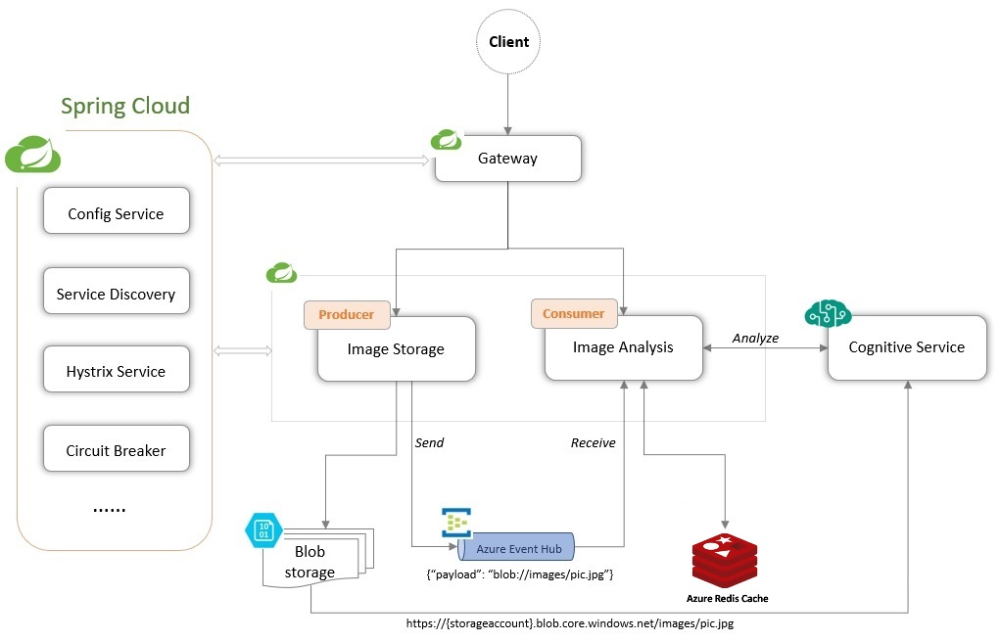

# Photo Gallery Project

The project includes a collection of micro services built on Spring Cloud that support photo uploading, storage to Azure blob, analysis with cognitive service and storage of analysis results to Azure SQL server. Image storage service and image analysis service use Spring Cloud Stream Azure Event Hub binder to bind Azure Event Hub as message channel.

## Tools
* Java 8
* Maven
* Postman https://www.getpostman.com/apps

## Architecture


1. #### Users upload images by calling REST API defined in `image-storage` service.
1. #### `image-storage` takes the uploaded image as a `MultipartFile` and stores it's inputstream into a location pointing to Azure blob storage.
1. #### `notificationSender` of `image-storage` sends the message to a `output` channel backed by Azure Event Hub. The `output` channel is configured in `spring.cloud.stream.bindings.output.destination`. The message contains payload of image location e.g. `blob://images/pic.jpg`
1. #### `notificationReceiver` of `image-analyzer` has a `StreamListener` (annotated method e.g. onReceive) listening to a `input` channel also backed by Azure Event Hub. The `input` channel is configured in `spring.cloud.stream.bindings.input.destination` - the same `String` value of `output` channel as they are working against the same channel.
1. #### `notificationReceiver` receives message containing image location, loads blob at the location with `resourceLoader` and retrives full blob URL via `getURL()`. The `getURL()` method is implemented in `BlobStorageResource` which extends `AbstractResource` class (implements `Resource` interface).
1. #### Full blob URL then is sent as part of HttpPost request to Cognitive service REST API via a `@Cacheable("azureCache")` annotated method `String analyze(String imageURL)` and analysis result e.g. `[{"confidence":0.870581954633533,"text":"a bowl of oranges on a table"}]` is then cached into Azure Redis Cache service with cache key `azureCache::imageURL`.


## Demo Script

1. ### Go to aka.ms/springcloud
1. ### Add two custom services:
    * `image-analyzer` (modules: `azure-eventhub-binder`,`azure-storage`, port: `8080`)
    * `image-storage` (modules: `azure-eventhub-binder`, `azure-storage`, `azure-sql-server`, port: `8090`).
1. ### Keep `Controller.java` and SpringBootApplication Java files. Remove all the other generated files.
1. ### Create and put authorization file under `src/main/resources/` for both custom services.
    ```bash
    $  az account set --subscription <name or id>
    $  az ad sp create-for-rbac --sdk-auth > my.azureauth
    ```
1. ### `image-storage` service (VM options `-Dserver.port=8080`)

    - #### Update `image-storage.properties` in `cloud-config-server\resources\shared`

    ```yml
    server.port=8080

    spring.cloud.azure.credentialFilePath=my.azureauth
    spring.cloud.azure.resourceGroup=springone-cloud
    spring.cloud.azure.region=eastus
    spring.cloud.azure.eventhub.namespace=springone-cloud-eh

    #Storage account name must be between 3 and 24 characters in length and use numbers and lower-case letters only.
    spring.cloud.stream.eventhub.checkpointStorageAccount=springonecloudstorage

    # For example here, the destination name of input and output should be the same.
    # Eventhub name can contain only lowercase letters, numbers, and the dash (-) character.
    # Every dash (-) character must be immediately preceded and followed by a letter or number.
    # Must be from 3 to 63 characters long.
    # for storage application, it only uses output, input.destination is actually not used/needed
    # Not needed
    # spring.cloud.stream.bindings.input.destination=springone-cloud-eh-channel
    # spring.cloud.stream.bindings.input.group=springone-cloud-eh-consumergroup
    spring.cloud.stream.bindings.output.destination=springone-cloud-eh-channel

    spring.cloud.azure.storage.account=springonecloudstorage
    ```
    - #### Define interface `ResourceStorage.java`

    ```java
    public interface ResourceStorage {
    Resource load(String location);
    void store(String location, InputStream inputStream) throws IOException;
    }
    ```

    - #### Create `BlobResourceStorage.java` that implements the interface
    ```java
    @Component
    public class BlobResourceStorage implements ResourceStorage {
        @Autowired
        ResourceLoader resourceLoader;

        @Override
        public Resource load(String blobLocation) {
            return this.resourceLoader.getResource(blobLocation);
        }

        @Override
        public void store(String blobLocation, InputStream blobInputStream) throws IOException {
            Resource blob = load(blobLocation);
            OutputStream os = ((WritableResource)blob).getOutputStream();
            IOUtils.copy(blobInputStream, os);
            os.close();
            blobInputStream.close();
        }
    }
    ```

    - #### Create `NotificationSender.java`

    ```java
    @EnableBinding(Source.class)
    @Component
    public class NotificationSender {
        private static final Logger LOGGER = LoggerFactory.getLogger(NotificationSender.class);
        @Autowired
        ResourceLoader resourceLoader;
        @Autowired
        Source sender;
        @Autowired
        MessageChannel output;

        public void doSend(String blobLocation) {
            //this.sender.output().send(new GenericMessage<>(blobLocation));
            this.output.send(new GenericMessage<>(blobLocation));
            LOGGER.info("Payload: '" + blobLocation + "' sent!");
        }
    }
    ```
    - #### Move `Controller.java`
    ```java
    @RestController
    public class Controller {

        @RequestMapping(value = "/", method = RequestMethod.GET)
        public String sayHello() {
            return "Say Hello World!";
        }

        @Autowired
        public ResourceStorage resourceStorageService;

        @Autowired
        public NotificationSender notificationSender;

        @GetMapping("/images/{imageName}")
        @ResponseBody
        public ResponseEntity<Resource> serveImage(@PathVariable String imageName) throws IOException {
            Resource image = resourceStorageService.load("blob://images/" + imageName);
            String contentType = "application/octet-stream";
            return ResponseEntity.ok()
                    .contentType(MediaType.parseMediaType(contentType))
                    .body(new InputStreamResource(image.getInputStream()));
        }

        @PostMapping("/upload")
        public String updateImage(@RequestParam("image") MultipartFile image) throws IOException {
            String imageLocation = "blob://images/" + image.getOriginalFilename();
            //1. store image
            resourceStorageService.store(imageLocation, image.getInputStream());
            //2. send notification
            notificationSender.doSend(imageLocation);
            return "redirect:/";
        }
    }
    ```
    - #### Run image storage service with POSTMAN and Azure Storage Explorer see if `upload` succeeds with image stored in Azure blob and notification containing `imageLocation` sent.
1. ### `image-analyzer` service (VM options `-Dserver.port=8090`)

    - #### Update `application.properties`
    ```yml
    server.port=8090

    spring.cloud.azure.credentialFilePath=my.azureauth
    spring.cloud.azure.resourceGroup=springone-cloud
    spring.cloud.azure.region=eastus
    spring.cloud.azure.eventhub.namespace=springone-cloud-eh

    #Storage account name must be between 3 and 24 characters in length and use numbers and lower-case letters only.
    spring.cloud.stream.eventhub.checkpointStorageAccount=springonecloudstorage

    # For example here, the destination name of input and output should be the same.
    # Eventhub name can contain only lowercase letters, numbers, and the dash (-) character.
    # Every dash (-) character must be immediately preceded and followed by a letter or number.
    # Must be from 3 to 63 characters long.
    spring.cloud.stream.bindings.input.destination=springone-cloud-eh-channel
    spring.cloud.stream.bindings.input.group=springone-cloud-eh-consumergroup
    # Not needed
    # spring.cloud.stream.bindings.output.destination=springone-cloud-eh-channel

    spring.cloud.azure.storage.account=springonecloudstorage

    #Azure Redis cache
    spring.cloud.azure.redis.name=springone-cloud-redis
    ```
    - #### Add `NotificationReceiver.java`
    ```java
    @EnableBinding(Sink.class)
    public class NotificationReceiver {
        private static final Logger LOGGER = LoggerFactory.getLogger(NotificationReceiver.class);

        @Autowired
        ResourceLoader resourceLoader;

        @Autowired
        ImageAnalysisService svc;

        @StreamListener(Sink.INPUT)
        public void onReceive(String blobLocaiton) throws IOException, URISyntaxException, JSONException {
            LOGGER.info("Received: " + blobLocaiton);
            Resource blobResource = this.resourceLoader.getResource(blobLocaiton);
            String res = this.svc.analyze(blobResource.getURL().toString());
            LOGGER.info(res);
        }
    }
    ```
    - #### Move `ImageAnalysisService.java`. Mention `@Cacheable` annotation
    ```java
    @Component
    public class ImageAnalysisService {

        private static final Logger LOGGER = LoggerFactory.getLogger(ImageAnalysisService.class);

        private String apiKey = "6cbdab0344de4c6aba54caa60fc57567";
        private String uriBase = "https://eastus.api.cognitive.microsoft.com/vision/v1.0/analyze";

        @Cacheable("azureCache")
        public String analyze(String imageURL) throws URISyntaxException, IOException, JSONException {
            CloseableHttpClient httpclient = HttpClients.createDefault();
            URIBuilder builder = new URIBuilder(uriBase);
            // Request parameters. All of them are optional.
            builder.setParameter("visualFeatures", "Categories,Description,Color");
            builder.setParameter("language", "en");
            // Prepare the URI for the REST API call.
            URI uri = builder.build();
            HttpPost request = new HttpPost(uri);
            // Request headers.
            request.setHeader("Content-Type", "application/json");
            request.setHeader("Ocp-Apim-Subscription-Key", apiKey);
            // Request body.
            StringEntity reqEntity = new StringEntity("{\"url\":\"" + imageURL + "\"}");
            request.setEntity(reqEntity);
            // Execute the REST API call and get the response entity.
            HttpResponse response = httpclient.execute(request);
            if(response.getStatusLine().getStatusCode() == HttpStatus.SC_OK) {
                HttpEntity entity = response.getEntity();
                if (entity != null)
                {
                    JSONObject json = new JSONObject(EntityUtils.toString(entity));
                    return json.getJSONObject("description").get("captions").toString();
                }
            }
            LOGGER.info("Analysis result is null");
            return "";
        }
    }
    ```
1. ### Verify with Postman.
    - #### HTTP POST to `http://localhost:8080/upload` with key `image` and value image file e.g. `orange.jpg` should give you the following in image-analyzer console:
    ```yml
    c.e.springonedemo.NotificationReceiver   : Received: blob://images/orange.jpg
    c.e.springonedemo.ImageAnalysisService   : [{"confidence":0.870581954633533,"text":"a bowl of oranges on a table"}]
    ```
    - #### Go to Azure Redis Cache console and run `keys *` should give you below entry:
    ```yml
    ...
     3) "azureCache::http://springonecloudstorage.blob.core.windows.net/images/orange.jpg"
    ...
    ```